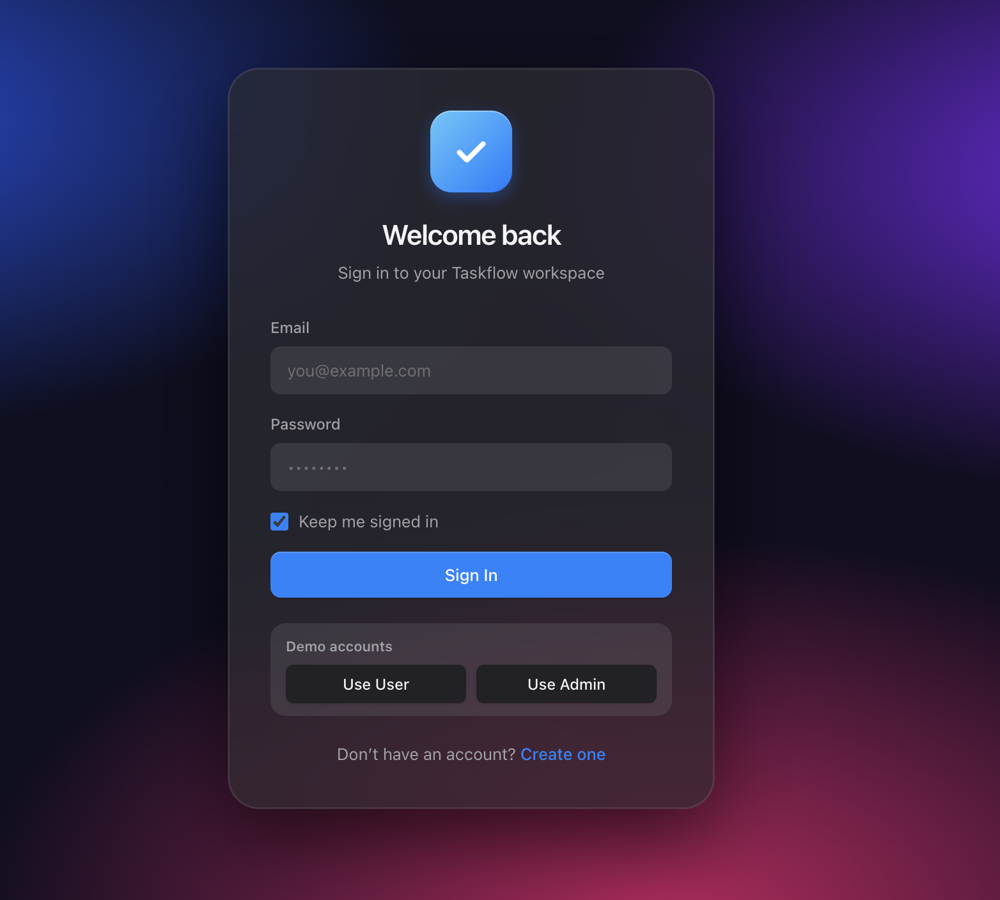
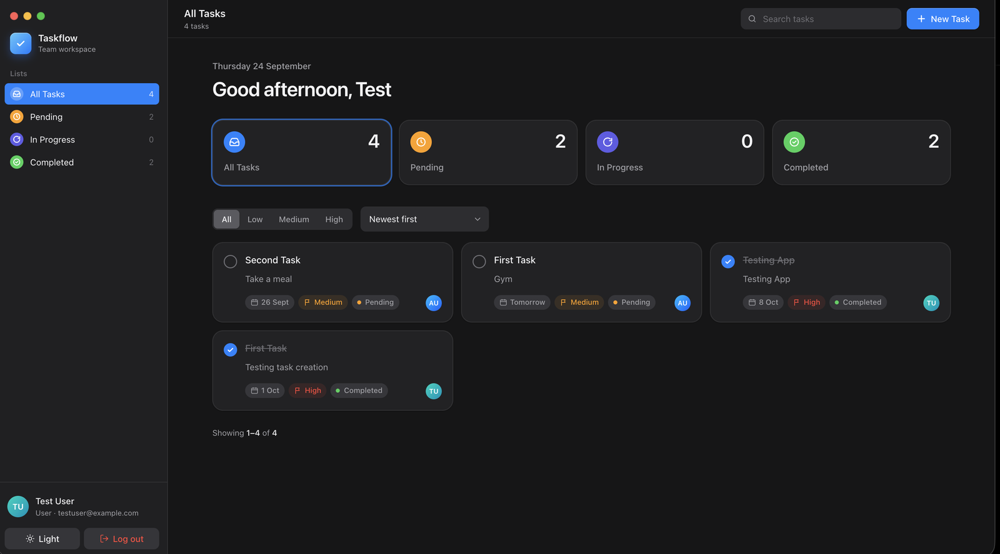
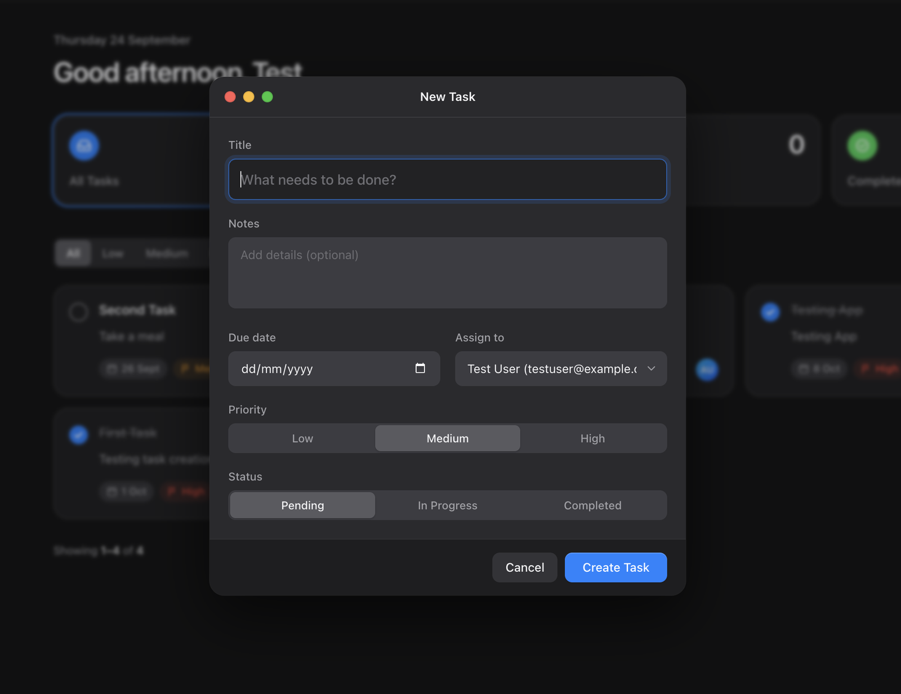
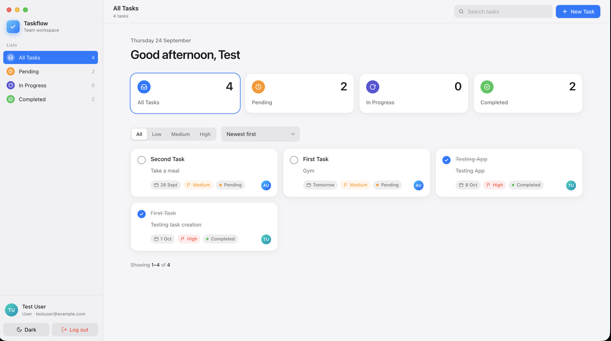

# Taskflow — Task & Team Management Platform

A full-stack task management app with JWT authentication, task CRUD, search / filters / sorting, pagination, and a macOS-inspired responsive UI with dark mode.

**Frontend:** React · Vite · Redux Toolkit · React Router · Axios · Tailwind CSS
**Backend:** Node.js · Express · MongoDB Atlas (Mongoose) · JWT · bcrypt
**Deployment:** Vercel (frontend) · Render (backend) · MongoDB Atlas (database)

---

## Live Demo

| | URL |
|---|---|
| **Frontend (Vercel)** | https://task-management-platform-sepia.vercel.app |
| **Backend API (Render)** | https://task-management-platform-wbvq.onrender.com |
| **Repository** | https://github.com/aniruddha07S/task-management-platform |

> ⏳ The backend runs on Render's free tier and sleeps when idle — the **first request can take up to ~50 seconds** to wake it up. After that it responds normally.

## Login Credentials (deployed site)

| Role | Email | Password |
|---|---|---|
| User | `testuser@example.com` | `Test@1234` |
| Admin | `admin@example.com` | `Admin@1234` |

Both accounts are pre-seeded. The login page also has **"Use User" / "Use Admin"** buttons that fill these in.

---

## Screenshots

| Login | Dashboard (dark) |
|---|---|
|  |  |

| New task | Dashboard (light) |
|---|---|
|  |  |

---

## Features

### Core
- **Authentication** — register, login, logout, JWT-protected routes, **Remember Me** (localStorage vs sessionStorage), passwords hashed with **bcrypt**
- **Dashboard** — sidebar, top navbar, stat cards for **Total / Pending / In Progress / Completed**
- **Tasks** — create, edit, delete (with confirmation), view details, mark complete in one click
- **Task fields** — title, description, priority, due date, status, assigned user
- **Search & filters** — debounced title search, filter by status (sidebar / cards) and priority, sort by due date

### Bonus (4 implemented)
| Feature | Where |
|---|---|
| 🌙 **Dark Mode** | Toggle in sidebar & login page; persisted; respects system preference |
| 🔔 **Toast Notifications** | `react-hot-toast` on create / update / delete / complete / logout |
| 📄 **Pagination** | Server-side `page` & `limit`, with a `/tasks/stats` endpoint so counts stay correct across pages |
| 🐳 **Docker** | `server/Dockerfile`, `client/Dockerfile` (nginx), root `docker-compose.yml` |

### React concepts used
| Concept | Where |
|---|---|
| `useState`, `useEffect` | All pages & forms (`Dashboard.jsx`, `TaskForm.jsx`, `Login.jsx`) |
| `useMemo` | Derived task lookup, theme context value |
| `useCallback` | All Dashboard handlers passed to memoized children |
| `React.memo` | `TaskCard`, `StatCard`, `Sidebar`, `Segmented`, `Pagination` |
| Custom hooks | `useDebounce` (search), `useTheme` |
| Redux Toolkit | `authSlice`, `tasksSlice` (async thunks) |
| Context API | `ThemeContext` / `ThemeProvider` |
| Lazy loading + Suspense | Route-level `React.lazy` for Login / Register / Dashboard |
| Form validation | Required fields, email format, password rules + confirm, duplicate users (API), invalid JWT → auto-logout |

### Error handling
| Code | Handling |
|---|---|
| **400** | Missing/invalid fields, invalid filter values, invalid IDs, duplicate email, wrong credentials |
| **401** | Missing / invalid / expired JWT → frontend clears session and redirects to login |
| **404** | Unknown task ID or unknown route |
| **Network** | Axios interceptor shows "Network error — cannot reach the server" |

---

## Tech Stack

| Layer | Tech |
|---|---|
| Frontend | React 19, Vite, React Router 7, Redux Toolkit, Axios, Tailwind CSS v4, react-hot-toast |
| Backend | Node.js, Express 5, Mongoose 9, jsonwebtoken, bcrypt, cors, dotenv |
| Database | MongoDB Atlas |
| DevOps | Vercel, Render, Docker / Docker Compose |

---

## Folder Structure

```
task-management-platform/
├── client/                     # React + Vite frontend
│   ├── src/
│   │   ├── components/         # TaskCard, TaskForm, TaskDetail, Sidebar, StatCard, Pagination…
│   │   │   └── ui/             # Modal, ConfirmDialog, Segmented, Select, Avatar, Badges…
│   │   ├── constants/          # Task lists, priority/status metadata
│   │   ├── context/            # ThemeContext + ThemeProvider (dark mode)
│   │   ├── hooks/              # useDebounce, useTheme
│   │   ├── pages/              # Login, Register, Dashboard
│   │   ├── services/           # api.js (Axios instance + interceptors)
│   │   ├── store/              # Redux store, authSlice, tasksSlice
│   │   └── utils/              # authStorage (remember me), date helpers
│   ├── Dockerfile · nginx.conf · vercel.json
│   └── .env.example
├── server/                     # Express API
│   ├── config/                 # seed.js (test accounts)
│   ├── controllers/            # authController, taskController
│   ├── middleware/             # auth.js (JWT verification)
│   ├── models/                 # User, Task (Mongoose)
│   ├── routes/                 # authRoutes, taskRoutes
│   ├── server.js
│   ├── Dockerfile
│   └── .env.example
├── docs/screenshots/
├── Taskflow.postman_collection.json
└── docker-compose.yml
```

---

## Local Setup

**Prerequisites:** Node.js 20+, a MongoDB Atlas cluster (or local MongoDB).

### 1. Clone
```bash
git clone https://github.com/aniruddha07S/task-management-platform.git
cd task-management-platform
```

### 2. Backend
```bash
cd server
npm install
cp .env.example .env      # then fill in MONGO_URI and JWT_SECRET
npm run seed              # creates the two test accounts
npm run dev               # → http://localhost:5001
```

| Variable | Description |
|---|---|
| `PORT` | API port (default `5001`; macOS AirPlay occupies 5000) |
| `MONGO_URI` | MongoDB connection string |
| `JWT_SECRET` | Secret for signing tokens |
| `CLIENT_URL` | Allowed frontend origin(s), comma-separated, no trailing slash |

### 3. Frontend
```bash
cd client
npm install
cp .env.example .env      # VITE_API_URL=http://localhost:5001
npm run dev               # → http://localhost:5173
```

### 4. Or run everything with Docker
```bash
# requires server/.env
docker compose up --build
# Frontend → http://localhost:3000   Backend → http://localhost:5001
```

---

## API Documentation

**Base URL:** `https://task-management-platform-wbvq.onrender.com` (local: `http://localhost:5001`)
All requests and responses are JSON. Protected routes require:
```
Authorization: Bearer <token>
```

A ready-to-import **Postman collection** is included: [`Taskflow.postman_collection.json`](Taskflow.postman_collection.json). Running **Login** saves the token automatically for all other requests.

### Endpoints

| Method | Endpoint | Auth | Description |
|---|---|---|---|
| POST | `/api/auth/register` | — | Create an account |
| POST | `/api/auth/login` | — | Log in, returns JWT |
| GET | `/api/auth/users` | ✅ | List users (for task assignment) |
| GET | `/api/tasks` | ✅ | List tasks (search / filter / sort / paginate) |
| GET | `/api/tasks/stats` | ✅ | Task counts per status |
| GET | `/api/tasks/:id` | ✅ | Get one task |
| POST | `/api/tasks` | ✅ | Create a task |
| PUT | `/api/tasks/:id` | ✅ | Update a task |
| DELETE | `/api/tasks/:id` | ✅ | Delete a task |

---

### POST `/api/auth/register`
```json
// Request
{ "name": "Jane Doe", "email": "jane@example.com", "password": "secret123" }

// 201 Created
{
  "token": "eyJhbGciOiJIUzI1NiIs...",
  "user": { "id": "6650a1f2...", "name": "Jane Doe", "email": "jane@example.com", "role": "user" }
}

// 400 — { "message": "All fields are required" }
// 400 — { "message": "User with this email already exists" }
```

### POST `/api/auth/login`
```json
// Request  (rememberMe: true → 30-day token, false → 1-day token)
{ "email": "testuser@example.com", "password": "Test@1234", "rememberMe": true }

// 200 OK
{
  "token": "eyJhbGciOiJIUzI1NiIs...",
  "user": { "id": "6ab3c06e...", "name": "Test User", "email": "testuser@example.com", "role": "user" }
}

// 400 — { "message": "Invalid credentials" }
```

### GET `/api/auth/users` 🔒
```json
// 200 OK
[
  { "_id": "6ab3c4ef...", "name": "Admin User", "email": "admin@example.com", "role": "admin" },
  { "_id": "6ab3c06e...", "name": "Test User", "email": "testuser@example.com", "role": "user" }
]
```

### GET `/api/tasks` 🔒
| Query param | Values | Default |
|---|---|---|
| `search` | text (case-insensitive title match) | — |
| `status` | `Pending` · `In Progress` · `Completed` | all |
| `priority` | `Low` · `Medium` · `High` | all |
| `sort` | `asc` / `desc` (by due date) | newest created first |
| `page` | ≥ 1 | `1` |
| `limit` | 1–50 | `9` |

Example: `GET /api/tasks?search=report&status=Pending&priority=High&sort=asc&page=1&limit=9`
```json
// 200 OK
{
  "tasks": [
    {
      "_id": "6ab4...",
      "title": "Quarterly report",
      "description": "Draft and share with the team",
      "priority": "High",
      "dueDate": "2026-10-01T00:00:00.000Z",
      "status": "Pending",
      "assignedUser": { "_id": "6ab3c06e...", "name": "Test User", "email": "testuser@example.com" },
      "createdAt": "2026-09-24T10:00:00.000Z",
      "updatedAt": "2026-09-24T10:00:00.000Z"
    }
  ],
  "pagination": { "page": 1, "limit": 9, "total": 1, "totalPages": 1 }
}

// 400 — { "message": "Invalid status \"Done\"" }
```

### GET `/api/tasks/stats` 🔒
Accepts `search` and `priority` (same as above).
```json
// 200 OK
{ "total": 4, "pending": 2, "inProgress": 0, "completed": 2 }
```

### GET `/api/tasks/:id` 🔒
```json
// 200 OK → single task object (same shape as above)
// 404 — { "message": "Task not found" }
// 400 — invalid ObjectId
```

### POST `/api/tasks` 🔒
```json
// Request  (title, dueDate, assignedUser required)
{
  "title": "Quarterly report",
  "description": "Draft and share with the team",
  "priority": "High",
  "dueDate": "2026-10-01",
  "status": "Pending",
  "assignedUser": "6ab3c06e..."
}

// 201 Created → created task (assignedUser populated)
// 400 — { "message": "Title, due date, and assigned user are required" }
```

### PUT `/api/tasks/:id` 🔒
Send any subset of task fields; validation runs on update.
```json
// Request
{ "status": "Completed" }

// 200 OK → updated task
// 404 — { "message": "Task not found" }
```

### DELETE `/api/tasks/:id` 🔒
```json
// 200 OK — { "message": "Task deleted successfully" }
// 404 — { "message": "Task not found" }
```

### Common errors
```json
// 401 — { "message": "No token provided, authorization denied" }
// 401 — { "message": "Invalid or expired token" }
// 404 — { "message": "Route not found" }
// 500 — { "message": "Something went wrong on the server" }
```

---

## Database Design

**User**
| Field | Type | Rules |
|---|---|---|
| `name` | String | required, trimmed |
| `email` | String | required, unique, lowercase, email format |
| `password` | String | required, min 6, **bcrypt-hashed** |
| `role` | String | `user` \| `admin`, default `user` |
| `createdAt / updatedAt` | Date | automatic |

**Task**
| Field | Type | Rules |
|---|---|---|
| `title` | String | required, trimmed |
| `description` | String | default `""` |
| `priority` | String | `Low` \| `Medium` \| `High`, default `Medium` |
| `dueDate` | Date | required |
| `status` | String | `Pending` \| `In Progress` \| `Completed`, default `Pending` |
| `assignedUser` | ObjectId → **User** | required (populated with name & email) |
| `createdAt / updatedAt` | Date | automatic |

---

## Deployment

| Tier | Platform | Notes |
|---|---|---|
| Frontend | Vercel | Root `client`, env `VITE_API_URL`; `vercel.json` rewrites all routes to `index.html` for SPA refreshes |
| Backend | Render | Root `server`, `npm install` → `node server.js`; env `MONGO_URI`, `JWT_SECRET`, `CLIENT_URL` |
| Database | MongoDB Atlas | M0 cluster; network access allows Render's dynamic IPs |

The backend retries the MongoDB connection automatically on startup failure, and CORS accepts a comma-separated list of origins.
